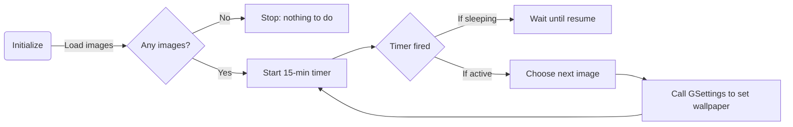

# Executive Summary  
This report outlines the design and implementation of a **safe GNOME Shell extension** for Ubuntu that adds a panel icon (left/center/right configurable) to **rotate desktop wallpapers** from a user-specified directory every 15 minutes.  The extension uses only user-level settings and APIs (no system-file modifications) by leveraging GNOME GSettings and GJS APIs.  It provides a dropdown menu listing available wallpapers (with thumbnails) to allow manual selection.  Key components include a `PanelMenu.Button` for the icon, a timer using `GLib.timeout_add_seconds`, and `Gio.Settings` to change the wallpaper.  Preferences (via `prefs.js`) allow users to set the wallpaper folder, timer, and icon position.  The design ensures that on suspend/resume the timer is paused and resumed, and that invalid image formats are skipped with errors logged.  Packaging uses the `gnome-extensions` tool and Debian packaging best practices.  A file-by-file structure is proposed, along with example code snippets.  A development timeline and safety testing procedures are also provided.

```mermaid
flowchart LR
    subgraph Extension Components
        PanelIcon[Panel Icon Button] 
        PopupMenu[Menu (PopupMenu)]
        WallpaperManager[Wallpaper Manager (Timer, File IO)]
        Settings[GSettings (org.gnome.shell.extensions.wallpager)]
        Preferences[Prefs UI (GTK4)]
    end
    PanelIcon -->|on-click| PopupMenu
    PopupMenu -->|select wallpaper| WallpaperManager
    PopupMenu -->|contains list| WallpaperManager
    WallpaperManager -->|reads files| GioFile[Gio.File I/O]
    WallpaperManager -->|sets wallpaper via| Settings
    Settings -->|store preferences| Preferences
    Preferences -->|writes GSettings| Settings
    PanelIcon -->|configures| Preferences
```

## 1. Extension Architecture and File Structure  
The extension follows standard GNOME Shell conventions【3†L219-L228】【28†L190-L199】.  Key files include:

- **`metadata.json`**: defines `uuid`, `name`, `description`, `shell-version` (e.g. `["40", "45"]` to cover recent GNOME), optional `settings-schema` for GSettings.  
- **`extension.js`** (or `main.js`): the entry point, exporting `enable()` and `disable()` functions.  It creates the panel button (`PanelMenu.Button`), builds the popup menu, starts the wallpaper rotation timer, and handles cleanup【3†L231-L240】【30†L325-L333】.  
- **`prefs.js`**: (optional) a GTK4-based preferences dialog for user settings (folder path, interval, icon position).  It uses `Gio.Settings` with a custom schema (e.g. `org.gnome.shell.extensions.wallpager`)【28†L124-L133】【30†L325-L333】.  
- **`schemas/org.gnome.shell.extensions.wallpager.gschema.xml`**: the GSettings schema defining keys (e.g. `wallpaper-dir`, `interval`, `icon-position`).  This is compiled via `glib-compile-schemas`.  
- **`stylesheet.css`** (optional): theming of menu items if needed.  
- **Icon assets**: e.g. `panel-icon.svg` for the status icon.  
- **README/CHANGELOG** (packaging).  

A proposed file table with brief contents:  

| File                          | Description                                                              | Key Snippet(s)                                                            |
|-------------------------------|---------------------------------------------------------------------------|---------------------------------------------------------------------------|
| `metadata.json`               | Extension metadata (UUID, name, versions, schema)                         | `"uuid": "wallpager@example.com", ... "settings-schema": "org.gnome.shell.extensions.wallpager"`【28†L190-L199】 |
| `extension.js`                | Main extension logic: enable/disable, UI setup, timer                    | `this._button = new PanelMenu.Button(...); Main.panel.addToStatusArea(..., this._button, position, Main.panel._leftBox); ... this._timerId = GLib.timeout_add_seconds(..., changeWallpaper)` |
| `prefs.js`                    | Preferences UI (GTK4) to configure folder, interval, placement           | `window._settings = this.getSettings(); window._settings.bind('interval', switchRow, 'active', Gio.SettingsBindFlags.DEFAULT);`【30†L327-L336】【30†L348-L359】 |
| `schemas/wallpager.gschema.xml` | GSettings schema defining keys (`wallpaper-dir`, etc.)                    | `<key name="wallpaper-dir" type="s"><default>'~/Pictures/Wallpapers'</default></key>` |
| `panel-icon.svg`              | Status icon for panel                                                    | (SVG icon file)                                                             |
| `README.md`                   | Description, installation, usage                                          | (Markdown instructions)                                                     |

Each file should be placed under `~/.local/share/gnome-shell/extensions/wallpager@example.com/`, with `extension.js` and `metadata.json` in the root, and `schemas/` containing the schema XML.

## 2. Panel Icon and Menu UI  
The extension uses `PanelMenu.Button` (a `SystemStatusButton`) to insert an icon into the GNOME top bar【3†L231-L240】.  Depending on user configuration (prefs), the icon can be added to the left, center, or right section of the panel using `Main.panel.addToStatusArea()` with the optional `box` parameter【14†L7-L10】. For example: 
```js
// positionIndex = integer, box = Main.panel._leftBox/_centerBox/_rightBox
Main.panel.addToStatusArea(this.uuid, this._button, positionIndex, Main.panel._leftBox);
```
- **Left box** (`Main.panel._leftBox`): next to Activities.  
- **Center box** (`Main.panel._centerBox`): near the clock area (GNOME 40+).  
- **Right box** (`Main.panel._rightBox`): system menu side (default if omitted)【14†L7-L10】.  

*Example:*  
```js
let position = 0; // order index
let box = (prefs.iconPosition == 'left' ? Main.panel._leftBox :
           prefs.iconPosition == 'center' ? Main.panel._centerBox :
           Main.panel._rightBox);
Main.panel.addToStatusArea(this.uuid, this._button, position, box);
```
The icon is an `St.Icon` (e.g. using `panel-icon.svg`) added as a child of the button【3†L235-L243】:
```js
let icon = new St.Icon({ icon_name: 'preferences-desktop-wallpaper-symbolic', style_class: 'system-status-icon' });
this._button.add_child(icon);
```

### Dropdown Menu Listing Wallpapers  
Clicking the panel icon toggles a popup menu built with the `PopupMenu` API【18†L164-L172】【20†L250-L259】. Each wallpaper in the directory is represented as a menu item. For instance, a simple implementation uses `PopupMenu.PopupMenuItem(label)` to show the filename, or `PopupMenu.PopupImageMenuItem(label, iconName)` to show an icon plus text【20†L252-L260】. To display thumbnails, the extension can load and scale image files into `GdkPixbuf.Pixbuf` and set them on an `St.Icon` inside a `PopupMenu.PopupBaseMenuItem`. Example snippet:
```js
import * as PopupMenu from 'resource:///org/gnome/shell/ui/popupMenu.js';
import Gio from 'gi://Gio';
import GdkPixbuf from 'gi://GdkPixbuf';

let file = Gio.File.new_for_path(wallpaperPath);
let loader = new GdkPixbuf.Pixbuf.new_from_file_at_scale(file.get_path(), 64, 36, true);
let imageIcon = new St.Icon({ gicon: new Gio.FileIcon({ file: file }), icon_type: St.IconType.FULLCOLOR });
imageIcon.set_gicon(loader.to_gicon());  // or use Pixbuf directly
let item = new PopupMenu.PopupBaseMenuItem();
item.add_child(imageIcon);
item.add_child(new St.Label({ text: file.get_basename() }));
item.connect('activate', () => setWallpaper(file.get_path()));
menu.addMenuItem(item);
```
(Alternatively, use `PopupImageMenuItem` with a symbolic icon and skip thumbnails if too complex.)  Each item’s `activate` signal calls a function (e.g. `setWallpaper(uri)`) to change the wallpaper immediately.

## 3. Secure Wallpaper Change (Per-User)  
To change the wallpaper without touching system files, we use GNOME’s GSettings schema `org.gnome.desktop.background`【9†L109-L118】. This modifies only the current user’s dconf. Example using GJS:
```js
const Gio = imports.gi.Gio;
let settings = new Gio.Settings({ schema: 'org.gnome.desktop.background' });
settings.set_string('picture-uri', 'file://' + filePath);
settings.sync();  // ensure write is applied【9†L174-L182】
```
This approach avoids system-wide changes and only affects the user’s session.  GNOME 40+ also supports `picture-uri` and `picture-options` (fit/zoom) for background, and optionally `org.gnome.desktop.background.primary-color` if using image with transparent areas.  After changing the setting, the wallpaper should update immediately. (The StackOverflow discussion confirms the need to call `Gio.Settings.sync()` after setting the key【9†L174-L182】.)  

We should always set the URI as `file://` plus the absolute path.  For safety, first verify the file exists and has an image MIME type (`image/png`, `image/jpeg`, etc.) via `file.query_info('standard::content-type', ...)`. If unsupported, skip it.  

```js
let info = file.query_info('standard::content-type', 0, null);
if (!info) return;
let mime = info.get_content_type();
if (!mime.startsWith('image/')) {
    log(`Skipping non-image: ${filePath}`);
    return;
}
```

## 4. Wallpaper Rotation Logic and Timer  

The core loop uses a GNOME/GLib timer to change wallpapers every 15 minutes (900 seconds). In `enable()`, after loading all valid image files into an array, start the timer:  
```js
const { GLib } = imports.gi;
this._timerId = GLib.timeout_add_seconds(GLib.PRIORITY_DEFAULT, 900, () => {
    this._nextWallpaper();
    return GLib.SOURCE_CONTINUE;
});
```
Here `_nextWallpaper()` selects the next image (e.g. cycling through the list or randomizing) and calls `setWallpaper(uri)`.  To support suspend/resume, listen for the `PrepareForSleep` signal on `org.freedesktop.login1.Manager` via `Gio.DBus`: when `PrepareForSleep(true)` is received, pause or clear the timer; when `PrepareForSleep(false)` is received (resuming), restart it.  For example:
```js
const Gio = imports.gi.Gio;
let bus = Gio.DBus.system;
bus.call('org.freedesktop.login1', '/org/freedesktop/login1',
         'org.freedesktop.login1.Manager', 'PrepareForSleep', null, null, Gio.DBusCallFlags.NONE, -1, null,
         (connection, result) => {
    let [isSleeping] = connection.call_finish(result).deepUnpack();
    if (isSleeping) {
        GLib.source_remove(this._timerId);
    } else {
        this._timerId = GLib.timeout_add_seconds(GLib.PRIORITY_DEFAULT, 900, this._nextWallpaper.bind(this));
    }
});
```
*(Note: the actual D-Bus signal handler uses `add_signal_watch()`, omitted here for brevity.)*  

**Flowchart of wallpaper-change logic:**  


When suspended, the timer should not change wallpapers (to avoid race conditions).  On resume, it continues from where it left off. The timer callback always returns `true` (`GLib.SOURCE_CONTINUE`) to keep it running.  

## 5. File I/O: Listing Wallpapers and Thumbnails  
On startup (and possibly when prefs change), the extension should scan the specified wallpaper directory. Using `Gio.File.enumerate_children()` yields file info entries. For each file entry, check if it is a regular file with an image MIME type:  
```js
let dir = Gio.File.new_for_path(wallpaperDir);
let enumerator = dir.enumerate_children('standard::name,standard::type,standard::content-type', Gio.FileQueryInfoFlags.NONE, null);
let info;
while ((info = enumerator.next_file(null))) {
    let type = info.get_file_type();
    if (type != Gio.FileType.REGULAR) continue;
    let contentType = info.get_content_type();
    if (!contentType.startsWith('image/')) continue;
    images.push(dir.get_child(info.get_name()).get_path());
}
enumerator.close(null);
```
This builds an array of valid image file paths.  To generate thumbnails for the menu, `GdkPixbuf.Pixbuf.new_from_file_at_scale()` can create scaled-down versions of each image.  Error handling is important: if `Pixbuf` load fails (invalid or unsupported format), catch the exception and skip that file (log a warning).  

Performance tip: **cache the list** of files instead of re-reading on every timer tick. Only re-scan if the directory changes (could watch with `Gio.FileMonitor`) or on each session start. For very large directories, consider adding a submenu or scrollbar, but typical use (e.g. personal wallpaper folder) should remain moderate. 

## 6. Preferences (prefs.js)  
A preferences dialog can expose user settings: wallpaper folder, rotate interval (e.g. 5/15/30 min), icon placement, whether to include subfolders, etc.  Using GTK4 and Adwaita widgets, the `prefs.js` script defines a `fillPreferencesWindow(window)` function【30†L327-L336】. It creates pages and rows bound to `Gio.Settings`.  Example binding:
```js
import Gio from 'gi://Gio';
import Adw from 'gi://Adw';
import { ExtensionPreferences, gettext as _ } from 'resource:///org/gnome/Shell/Extensions/js/extensions/prefs.js';

export default class WallpagerPreferences extends ExtensionPreferences {
    fillPreferencesWindow(window) {
        let settings = this.getSettings();

        // Page and group
        let page = new Adw.PreferencesPage({ title: _('General') });
        window.add(page);
        let group = new Adw.PreferencesGroup({ title: _('Wallpaper') });
        page.add(group);

        // Folder chooser row
        let folderRow = new Adw.PreferencesRow({
            title: _('Folder'),
            subtitle: _('Directory to load wallpapers from'),
        });
        let folderChooser = new Gtk.FileChooserButton({ action: Gtk.FileChooserAction.SELECT_FOLDER });
        folderRow.add_suffix(folderChooser);
        group.add(folderRow);
        // Bind to key "wallpaper-dir"
        settings.bind('wallpaper-dir', folderChooser, 'uri', Gio.SettingsBindFlags.DEFAULT);

        // Interval switch or combo
        let intervalRow = new Adw.ComboRow({ title: _('Interval'), subtitle: _('Wallpaper change interval') });
        ['5 min','15 min','30 min'].forEach((label, i) => {
            let item = new Adw.ComboRowItem({ label });
            intervalRow.add_item(item);
        });
        intervalRow.bind('selected', settings, 'interval', Gio.SettingsBindFlags.DEFAULT);
        group.add(intervalRow);

        // Position (Left,Center,Right)
        let posRow = new Adw.ComboRow({ title: _('Icon Position') });
        ['Left','Center','Right'].forEach((label, i) => {
            let item = new Adw.ComboRowItem({ label });
            posRow.add_item(item);
        });
        posRow.bind('selected', settings, 'icon-position', Gio.SettingsBindFlags.DEFAULT);
        group.add(posRow);
    }
}
```
This uses a GSettings key `wallpaper-dir` of type `s` (string, storing a URI), `interval` (`i` or `u` for number), and `icon-position` (`s`). The `metadata.json` must reference the `settings-schema` so that `getSettings()` works【28†L190-L199】.

## 7. Packaging, Permissions, Installation  
Use the `gnome-extensions` tool or create a zip bundle for distribution【33†L230-L239】. For Ubuntu packaging, one can provide a `.deb` package that installs to `/usr/share/gnome-shell/extensions/`, but for per-user installs, copying to `~/.local/share/gnome-shell/extensions/` is standard.  Key steps:

- **Compile schemas:** Run `glib-compile-schemas schemas/` in the extension directory to compile XML to a binary.  
- **Pack extension:** `gnome-extensions pack .` creates `uuid.zip` including `extension.js`, `metadata.json`, `prefs.js`, and compiled schema.  
- **Install for testing:** `gnome-extensions install uuid.zip` or manually extract to `~/.local/share/gnome-shell/extensions/uuid/`.  
- **Enable:** `gnome-extensions enable uuid`. GNOME will load the extension on next shell restart or login.  

No special system privileges are needed: the extension only accesses the user’s session via GSettings and file I/O in user dirs. Ensure that the `metadata.json` does **not** request any unusual `permissions` (GNOME extensions have no explicit permission system; any code runs in the shell process as the user)【33†L284-L293】. 

For Ubuntu, one could also provide the extension via a PPA or Apt by placing files in `/usr/share/gnome-shell/extensions/uuid/`, including the compiled schemas, icons, etc. The `schema` files must install to `glib-2.0/schemas/`, or rely on `gnome-extensions` auto-compilation【28†L162-L172】.

## 8. Testing and Safety Measures  
- **Enable/Disable:** During development, use `gnome-extensions enable/disable` or restart GNOME (`Alt+F2`, `r`) to reload. Errors in `enable()` should be caught so as not to crash the shell. Use `try...catch` around initialization code and log errors via `global.log()`.  
- **Extension Sandbox:** Extensions run in-process with GNOME Shell. A crash can disable the extension (GNOME detects faulty extensions). Provide a safe `disable()` that removes the panel icon and disconnects signals【3†L246-L250】.  
- **Rollback:** Users can disable or remove the extension if needed. On error, catch exceptions and show a notification (via `Main.notify()`) so the user can disable it from GNOME Tweaks or Extensions app.  
- **Testing:** Validate on different GNOME versions (3.36 through 45+) if possible. Use `journalctl /usr/bin/gnome-shell -f` to watch for logs related to the extension. Test suspend/resume behavior, ensuring wallpaper changes pause during suspend. Test with an empty or non-image directory (should handle gracefully).

## 9. Error Handling and Edge Cases  
- **Unsupported Formats:** Skip any files that do not have an image MIME type, log a warning. If an image load fails, catch the error and skip.  
- **No Images:** If the directory is empty or invalid, disable the timer and show no items in the menu, perhaps a menu label “No wallpapers found”.  
- **Directory Access:** If the folder is moved or deleted, catch `file.enumerate_children()` errors and prompt the user to fix the path in prefs.  
- **Large Files:** Loading full-resolution images can be memory-intensive. Use `GdkPixbuf.Pixbuf.new_from_file_at_scale()` to load scaled versions (e.g. 64px wide thumbnails)【23†L69-L78】. This avoids bloating the shell’s memory. Dispose of any unused pixbufs.  
- **Performance:** Keep the timer callback lightweight. Don’t re-scan the directory on every tick (unless intentionally allowing new images). Instead, maintain a cached list and only update it on demand or at startup.  

## 10. Performance and Memory Considerations  
- The extension should minimize its footprint in GNOME Shell (which is critical real-time). Long operations (like scanning a folder of hundreds of images) should ideally be done asynchronously or at initialization, not on the main loop. However, since GJS and Gio.File enumerations are relatively fast for moderate folders, it should suffice to run once at startup. For very large directories, consider deferring or splitting the load (use `GLib.idle_add()` to yield).  
- Caching: keep the list of file paths and thumbnails in memory, so only the wallpaper setting and minor GUI updates happen on each timer tick.  
- Thumbnails: scale down to small size (e.g. 64×64 px); use `PIXBUF` rather than full images. Removing the menu will free the icons (they are children of the panel menu, which is destroyed on disable).  

## 11. Development Timeline (Example)  
1. **Day 1 (Design & Setup):** Define metadata and folder structure. Set up GSettings schema (defaults).  
2. **Day 2 (Basic UI):** Create `extension.js`: make panel icon and popup menu with a static entry. Test add/remove in panel【3†L231-L240】.  
3. **Day 3 (File Scanning):** Implement directory scan using `Gio.File` and filter images. Populate menu with actual files (no thumbnails yet).  
4. **Day 4 (Change Wallpaper):** Write `_nextWallpaper()` to cycle images, calling `Gio.Settings.set_string("picture-uri", ...)`【9†L174-L182】. Test 15-minute timer works.  
5. **Day 5 (Prefs UI):** Add `prefs.js` to let user set folder and icon position. Bind to GSettings keys. Reload extension to use prefs.  
6. **Day 6 (Thumbnails and Error Handling):** Enhance menu items with `St.Icon` from scaled pixbufs. Add try/catch for file loading errors.  
7. **Day 7 (Suspend/Resume):** Implement DBus listener to pause/resume timer around system sleep.  
8. **Day 8 (Polish & Testing):** Write README, test on multiple GNOME versions. Use `gnome-extensions pack`, check install instructions. Ensure `disable()` cleans up.  
9. **Day 9 (Packaging):** Create final zip, test with `gnome-extensions install`. Optionally, build a Debian package and test apt install.  
10. **Day 10 (Release & Documentation):** Final review, add code comments, submit to GNOME Extensions or publish PPA.

This timeline is illustrative; actual development might iterate features and fix bugs along the way.

