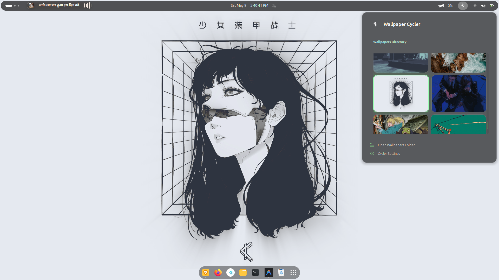
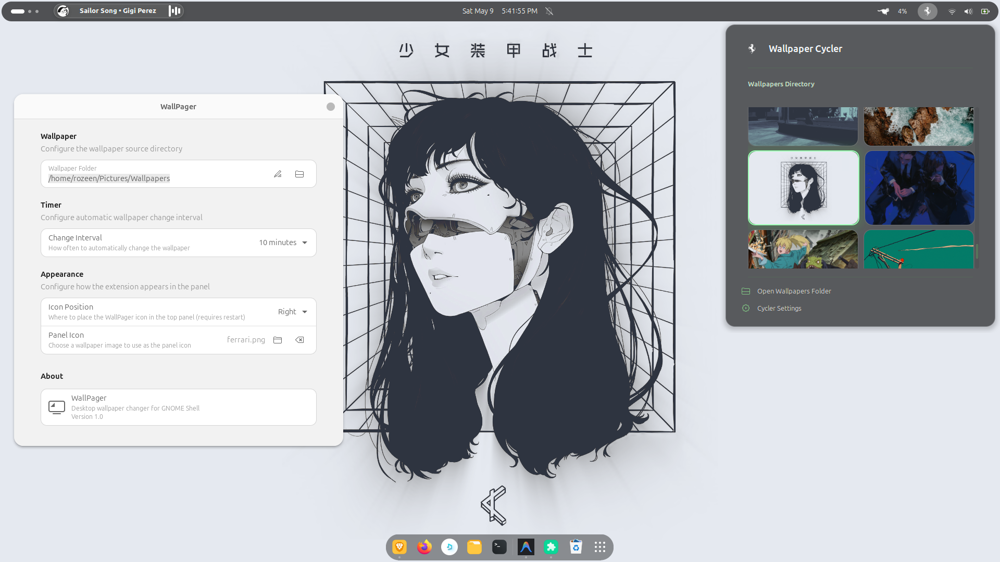

# WallPager — GNOME Shell Wallpaper Changer

A GNOME Shell extension that automatically changes your desktop wallpaper from a user-specified directory at configurable intervals.

## Features

- 🖼️ **Automatic wallpaper changing** — rotates through images in a folder at your chosen interval
- 📋 **Panel menu** — browse and select wallpapers from a dropdown with thumbnails
- ⏭️ **Quick controls** — next/previous wallpaper from the menu
- ⚙️ **Configurable** — set folder path, timer interval (5–60 min), and icon position
- 😴 **Suspend-aware** — pauses the timer when the system sleeps and resumes on wake
- 🛡️ **Safe** — only modifies user-level GSettings, no system files touched

## Compatibility

- GNOME Shell 45, 46
- Ubuntu 24.04+

## Previews


*The minimalist grid menu for quick wallpaper switching.*


*Customize every detail, including the panel icon and change intervals.*

## Features

- **Lucid Glass UI**: A modern, transparent design that blends perfectly with your desktop.
- **Custom Panel Logo**: Change the default WallPager icon to **any image** of your choice. It even center-crops and zooms automatically for a perfect fit!
- **High Performance Grid**: 2x2 grid with memory-efficient thumbnails.
- **Auto-Cycling**: Configurable intervals for automatic wallpaper changes.
- **No Clutter**: No text labels or scrollbars—just your wallpapers.

## Installation

### From Source

1. Clone or download this repository into your extensions directory:

```bash
cp -r wallpager@rozeenbaniya.com ~/.local/share/gnome-shell/extensions/
```

2. Compile the GSettings schemas:

```bash
cd ~/.local/share/gnome-shell/extensions/wallpager@rozeenbaniya.com
glib-compile-schemas schemas/
```

3. Restart GNOME Shell:
   - On X11: Press `Alt+F2`, type `r`, press Enter
   - On Wayland: Log out and log back in

4. Enable the extension:

```bash
gnome-extensions enable wallpager@rozeenbaniya.com
```

### Using gnome-extensions pack

```bash
cd wallpager@rozeenbaniya.com
gnome-extensions pack . --extra-source=README.md
gnome-extensions install wallpager@rozeenbaniya.com.shell-extension.zip
```

## Configuration

Open the extension preferences via:
- GNOME Extensions app → WallPager → Settings
- Or from the panel menu → Preferences

### Settings

| Setting | Description | Default |
|---------|-------------|---------|
| Wallpaper Folder | Directory containing wallpaper images | `~/Pictures/Wallpapers` |
| Change Interval | Time between automatic changes | 15 minutes |
| Icon Position | Panel icon location (left/center/right) | Right |

## Supported Image Formats

Any format recognized by GNOME as `image/*` MIME type, including:
- JPEG (.jpg, .jpeg)
- PNG (.png)
- WebP (.webp)
- BMP (.bmp)
- TIFF (.tiff)
- SVG (.svg)

## Troubleshooting

View extension logs:

```bash
journalctl /usr/bin/gnome-shell -f | grep WallPager
```

## License

This extension is free software. You can redistribute it and/or modify it.
